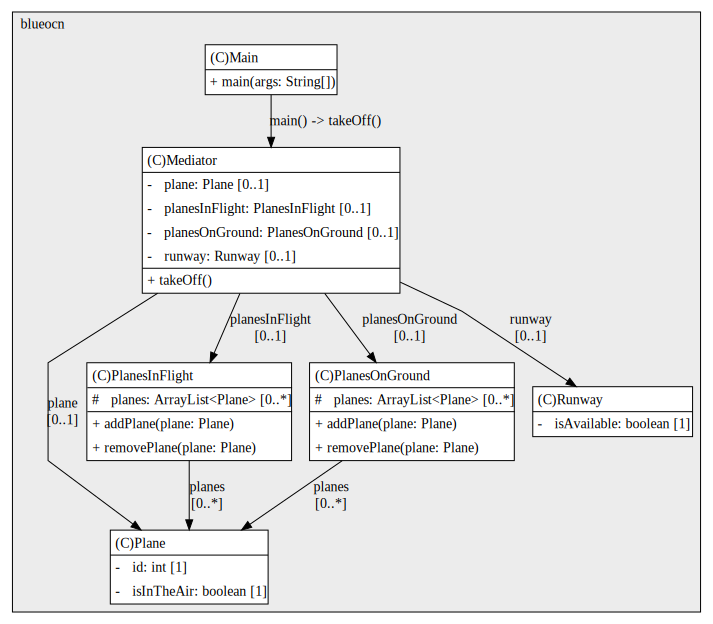

## Java Design Patterns: Behavioral

---

# Challenge
Let's have a look at our next exercise. In this one, you're going to be refactoring an air-traffic control app using the mediator pattern to remove tight coupling. So let's have a look at the code. In the main class, there is a main method which creates an object of type plane, and then cause a method called takeoff. Like the example in the previous videos, this looks fairly straightforward at first, but a closer look will show you that all of the classes are tightly coupled. If I look inside the plane class, it has fields for runway, planes in flight and planes on ground. So let's take a look at the takeoff method. 

This is making changes to each of these fields. If I wanted to add more planes, this would be difficult to do. How would they know about the planes in flight and planes on ground objects of the other planes? At the moment, this is too tightly coupled to extend the functionality. In this exercise, you should refactor this app to decouple these classes using the mediator pattern. You should create a mediator class, which will act as the air traffic controller and handle all of the actions needed for takeoff to happen. You'll then be able to remove the planes on ground, planes in air and runway fields from the plane class. And in the main class, instead of creating a plane object, you should have a mediator object which will also have a takeoff method. I'm estimating this might take you about 40 to 45 minutes. Good luck and have fun.

# Solution

This UML diagram models an air traffic control system using the Mediator pattern. The Mediator class acts as the central coordinator, managing interactions between Plane, Runway, PlanesOnGround, and PlanesInFlight. Instead of each class referencing and manipulating others directly, the Mediator encapsulates the logic for takeoff. When Main invokes takeOff(), the mediator checks runway availability, updates the plane’s status, and moves it from ground to flight. Plane holds its identity and flight status but delegates coordination to the mediator.

PlanesOnGround and PlanesInFlight manage collections of planes, exposing methods to add or remove them. Runway tracks availability, which the mediator consults before authorizing takeoff. This design eliminates tight coupling between flight-related classes, making the system easier to extend and maintain. The Mediator pattern here provides centralized control, clear separation of concerns, and scalable coordination logic.